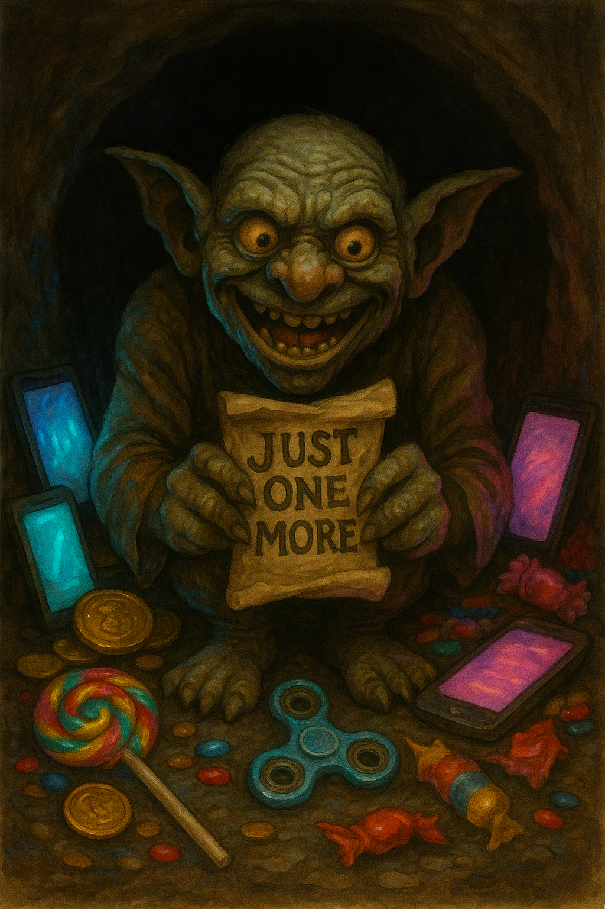

# 🧝‍♂️ The Dopamine Goblin


  
  

    Dopamine Goblin Portrait
    Download the art file: <a href="../DopamineGoblin.png">PNG</a> · <a href="../art/index.md">Gallery</a>
  

  
Battle Card

  <ul class="battle-card__list">
    <li><strong>Triggers:</strong> Shiny tabs, phone pings, novelty cravings when tasks feel dull.</li>
    <li><strong>First counter-move:</strong> Make a 20-minute Goblin deal with a pre-picked reward.</li>
    <li><strong>Printable:</strong> <a href="../site/printables/pdf/single-task-oath-card-ink.pdf">Single-Task Oath card (ink PDF)</a></li>
  </ul>

  Jump to
  <a href="#lore">Lore</a>
  <a href="#weaknesses">Weaknesses</a>
  <a href="#rituals">Rituals</a>
  <a href="#tools">Tools</a>

🏰 I. Bestiary Entry

> The Dopamine Goblin is small but mighty.
> It scuttles around the edges of your mind, waving shiny objects and shrieking “THIS is better!”
> It is a trickster spirit. It thrives on novelty, instant rewards, urgent distractions.
> It cannot kill you directly—but it can steal your hours one bite at a time.
> It promises fun. It delivers delay. It feeds on your need for stimulation.
>
> In myth, goblins are thieves, mischief-makers, lords of chaos.
> Your Dopamine Goblin is the spirit of just one more scroll, just one more game, just one more idea.
>
> You cannot kill the Goblin. But you can bargain with it. You can trap it. You can bribe it to work for you.

## 🔎 Monster Ecology (Lore and Sources) {#lore}

- Goblins in folklore → clever, greedy, can’t resist shiny things.
- ADHD brains = novelty-seeking, reward-driven, boredom-averse. (Barkley, 2015)
- Dopamine deficit → strong bias for immediate over delayed rewards. (Volkow et al., 2009)
- Delay discounting → prefer smaller-sooner over larger-later. (Sonuga-Barke, 2003)
- Digital distractions = infinite supply of shiny bait.

🧠 III. Clinical / Psychological Explanation

- ADHD is not a knowledge deficit—it’s a performance consistency problem.
- Dopamine‐regulated reward systems favor novelty and immediacy.
- Screens, social media, games → hyperstimulating, easy hits.
- Hard, boring tasks = low dopamine payoff → micro-avoidance.
- Solution = intentional salience, delayed gratification training, environmental design.

🔍 IV. Real-World Examples

- Reaching for the phone mid-task.
- Starting work, then opening social media.
- Checking email obsessively.
- Watching “just one more” video.
- Having 20 open tabs of new ideas.
- Switching hobbies instead of finishing.

## 🗝️ The Dopamine Goblin’s Weaknesses {#weaknesses}

- Pre-negotiated rewards.
- Clear time boundaries.
- High-salience framing for boring tasks.
- Environmental friction (blocking distractions).
- Novelty channeled into useful places.
- Humor → trick the Goblin to help.

## 🪄 Rituals and Counter-Spells {#rituals}

⭐ **Invocation: “Goblin, make a deal.”**
- Negotiate: “If I do X for 20 min, I get Y.”

⭐ **Goblin Jar**
- Write impulses on paper, seal them for later.
- Ritual of containment.

⭐ **Boundaries of the Realm**
- Use blockers or timers.
- Physical distance → no phone on desk.

⭐ **Reward Binding**
- Explicit promise: “After I do X, I get Y.”
- Forces the Goblin to earn its keep.

⭐ **Novelty Ritual**
- Rotate music, workspace, tools intentionally.
- Controlled novelty to satisfy its itch.

## 🛠️ Artifacts and Weapons {#tools}

- **Goblin Jar** → Physical place for postponed ideas.
- **Contract Scroll** → Written deal with yourself.
- **Time Stone** → Timer or Pomodoro app.
- **Shield of Friction** → App blockers, filters.
- **Bait of Choice** → Pre-selected reward.
- **Mirror of Intent** → Written session goal.

⚡️ VIII. Command Phrases

"Goblin, make a deal.”
“Earn your shiny.”
“Not now, little monster.”
“Later is not never.”
“Contain the chaos.”
“I choose the reward.”

🧪 IX. Science and Reason

- Delay discounting is steeper for ADHD brains. (Sonuga-Barke, 2003)
- “If-Then” plans increase follow-through. (Gollwitzer, 1999)
- Environmental friction reduces impulsivity.
- Behavioral Activation → intentional reward binding.
- Self-monitoring curbs mindless switching.

🛡️ X. Challenge for the Reader

- Name *YOUR* Dopamine Goblin.
- Define its favorite lie.
- Write your personal deal phrase.
- Build your Goblin Jar.
- Plan your reward binding.
- Test it for 7 days.
- Share your contract with the Guild.

🏷️ Tags

#adhd #dragons-and-distractions #dopamine-goblin #monster-page #obsidian

---

🔗 Quick Navigation

- 🗺️ Back to the [Monster Index](index.md)
- 🧭 Return to the [Welcome Page](../index.md)
- 🧰 Explore the [Armory & Spellbook](../spellbook/index.md)
- 📜 Visit [Site Tools & Templates](../site/index.md)

> “The Goblin is clever. Be cleverer.”
