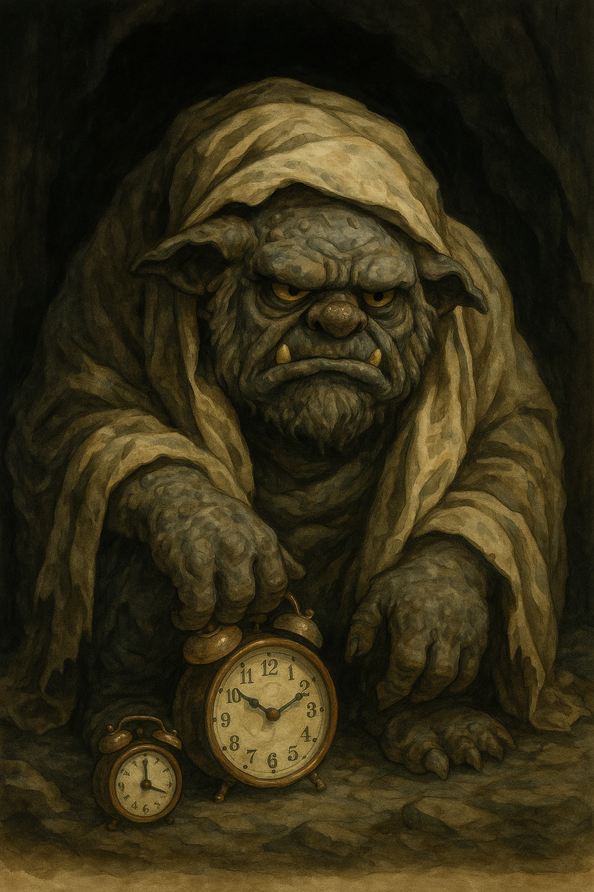

  
  

    Slumber Troll Portrait
    Download the art file: <a href="../SlumberTroll.png">PNG</a> · <a href="../art/index.md">Gallery</a>
  

  
Battle Card

  <ul class="battle-card__list">
    <li><strong>Triggers:</strong> Snooze spirals, warm darkness, “just five more minutes” bargaining.</li>
    <li><strong>First counter-move:</strong> 3-2-1 Go, flip on light, and send the “I’m vertical” text.</li>
    <li><strong>Printable:</strong> <a href="../site/printables/pdf/wake-invocation-checklist-ink.pdf">Wake Invocation checklist (ink PDF)</a></li>
  </ul>

  Jump to
  <a href="#lore">Lore</a>
  <a href="#weaknesses">Weaknesses</a>
  <a href="#rituals">Rituals</a>
  <a href="#tools">Tools</a>

🏰 I. Bestiary Entry

> Deep beneath the blankets of your mind’s realm lives the Slumber Troll.
> A hulking, smothering creature whose favorite meal is your lost time.
> It snores in caverns of soft pillows and trades dreams for delay.
> It sings the Lullaby of “Just Five More Minutes,” and wraps you in the Cloak of Comfort.
>
> Trolls in folklore were creatures of inertia and entrapment—lurking under bridges you must cross, demanding a toll of inaction or fear.
> In your life, the Slumber Troll is that threshold monster blocking the crossing from rest to movement, from sleep to wakefulness, from stillness to momentum.
>
> Facing the Slumber Troll is the first quest in any hero’s day. Without crossing this bridge, no other monster can be fought.

## 🔎 Monster Ecology (Lore and Sources) {#lore}

✅ Trolls in European folklore guard boundaries: caves, bridges, roads.
✅ ADHDers face “Initiation Impairment” (Russell Barkley, 2010) → struggle to cross from intention to action.
✅ Dopamine deficit reduces motivation for non-immediate rewards. (Volkow et al., 2009)
✅ Behavioral Activation → Rituals and environmental cues improve transitions. (Martell et al., 2001)
✅ Circadian cues (light, movement) anchor wakefulness and reduce sleep inertia.

🧠 III. Clinical / Psychological Explanation

- Transition problems: starting is harder than staying still.
- Low arousal → body clings to warmth and darkness.
- Rejection sensitivity → hiding from the day feels safer.
- Overlap with depression and anxiety → rest becomes avoidance.
- Solution = body-first activation, light, accountability, pre-decided rewards.

🔍 IV. Real-World Examples

- Snoozing repeatedly until you feel behind.
- Scrolling in bed instead of standing up.
- Skipping morning rituals because “it’s already too late.”
- Cancelling early plans to stay cocooned.
- Avoiding showers, clothes, or daylight because it feels like “too much.”

## 🗝️ The Slumber Troll’s Weaknesses {#weaknesses}

✅ Fire (salience) → light, scent, sound cues that break the fog.
✅ Body-first activation → move before you negotiate.
✅ Time-boxed rest → hibernation with a clock.
✅ Social rope → someone outside the cave holding tension.
✅ Reward as fuel → coffee, memes, sunlight earned by movement.

## 🪄 Rituals and Counter-Spells {#rituals}

⭐ **Invocation:** “Arise, motherfucker.” (Speak aloud as personal spell.)

⭐ **3-2-1 Go Rule:**
- No negotiation. Count down—and move.
- Source: Mel Robbins, *The 5 Second Rule*.

⭐ **Beacon of Dawn:**
- Light on, curtains open, alarm away from bed.
- Play one hype song the moment you stand.

⭐ **Accountability Rope:**
- Text “I’m vertical” to a friend or coworking chat.
- Send a photo outside the blankets at the agreed time.

⭐ **Time-Boxed Hibernation:**
- If you return to rest, set a timer (20–90 minutes).
- Name the wake-up action before you lie down.

## 🛠️ Artifacts and Weapons {#tools}

- **Cloak of Readiness** → Clothes laid out the night before.
- **Sword of 3-2-1 Go** → Irrefutable countdown.
- **Sigil of Accountability** → Text to a friend: “I’m up.”
- **Potion of Wakefulness** → Cold water or coffee.
- **Horn of Dawn** → Alarm that can’t be silenced without standing.
- **Candle of Resolve** → Light as ritual signifier.

⚡️ VIII. Command Phrases

“Arise, motherfucker.”
“Light the fire.”
“No negotiation.”
“The bed is lava.”
“I cross the bridge now.”

🧪 IX. Science and Reason

- ADHD brings time blindness → weaker urgency signal. (Barkley, 2010)
- Initiation impairment = transition problem, not knowledge deficit.
- Dopamine system undershoots for low-salience tasks.
- Behavioral Activation reduces avoidance through action first.
- Environmental cues become conditioned triggers for movement.

🛡️ X. Challenge for the Reader

- Name *YOUR* Slumber Troll.
- Define its favorite lie.
- Choose your personal command phrase.
- Build your anti-Troll ritual.
- Use your artifacts and weapons.
- Track it for 7 days.
- Share your victory (or battle scars) with the Guild.

🏷️ Tags

#adhd #dragons-and-distractions #slumber-troll #monster-page #obsidian

---

🔗 Quick Navigation

- 🗺️ Back to the [Monster Index](index.md)
- 🧭 Return to the [Welcome Page](../index.md)
- 🧰 Explore the [Armory & Spellbook](../spellbook/index.md)
- 📜 Visit [Site Tools & Templates](../site/index.md)

> “The Troll is strongest before dawn. Slay it once, and the rest of the day is yours.”
