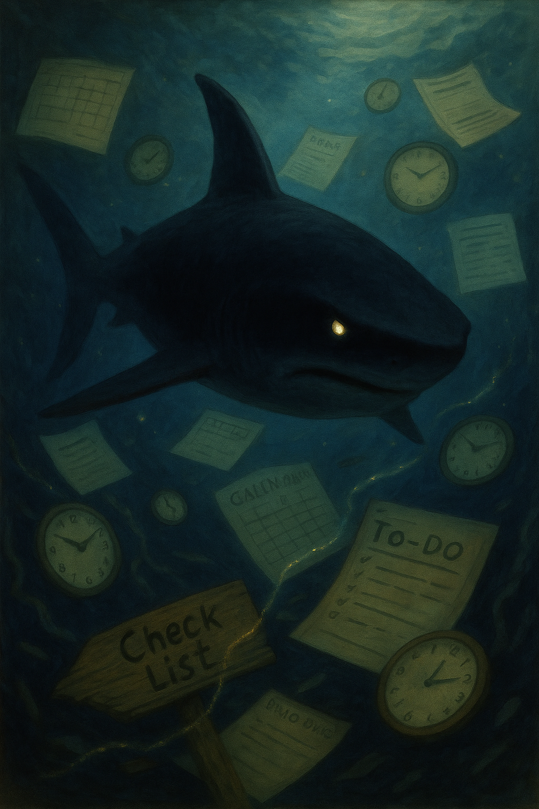

  
  

    Temporal Shark Portrait
    Download the art file: <a href="../TheTemporalShark.png">PNG</a> · <a href="../art/index.md">Gallery</a>
  

  
Battle Card

  <ul class="battle-card__list">
    <li><strong>Triggers:</strong> Time blindness, hidden prep steps, deadlines that only feel real at the last minute.</li>
    <li><strong>First counter-move:</strong> Place a Tide Mark start time with T-60 and T-15 alarms.</li>
    <li><strong>Printable:</strong> <a href="../site/printables/pdf/tide-mark-calendar-card-ink.pdf">Tide Mark calendar card (ink PDF)</a></li>
  </ul>

  Jump to
  <a href="#lore">Lore</a>
  <a href="#weaknesses">Weaknesses</a>
  <a href="#rituals">Rituals</a>
  <a href="#tools">Tools</a>

🏰 I. Bestiary Entry

> The Temporal Shark stalks the waters of your day, invisible until a deadline bleeds.
> It moves silently through hours you swore you had, then strikes when time is too tight to escape.
> You hear its theme song only when you open the calendar and realize: “Oh no… it’s today.”
>
> In legend, sharks smell blood from miles away. The Temporal Shark smells urgency and surfs it to the surface.
> It loves the taste of panic productivity and will starve you of preparation so the frenzy feels delicious.
> But you can tag it, track it, and swim with allies.

## 🔎 Monster Ecology (Lore and Sources) {#lore}

✅ Shark myths → sensing blood = sensing urgency.
✅ ADHD time blindness → difficulty sensing future cost until immediate.
✅ “Deadline adrenaline” → hyperfocus under stress.
✅ Planning fallacy → underestimating duration (Kahneman & Tversky, 1979).
✅ Future discounting → value now > value later.

🧠 III. Clinical / Psychological Explanation

✅ Working memory limits → future steps vanish until triggered.
✅ Interoception gaps → brain doesn’t feel time passing reliably.
✅ Emotional regulation → panic becomes the ignition source.
✅ Hyperfocus → surge of dopamine when urgency spikes.
✅ Solution = externalized time cues, precommitment, staged alarms.

🔍 IV. Real-World Examples

- “I have all afternoon” turning into “Meeting starts in 7 minutes.”
- Starting a report at 10pm because the due date feels real only then.
- Ignoring prep emails until the calendar alarm screams.
- Assuming a 2-hour task fits into a 45-minute window.
- Feeling weirdly calm until the shark fin appears.

## 🗝️ The Temporal Shark’s Weaknesses {#weaknesses}

✅ Time beacons → visible, audible reminders before danger.
✅ Pre-decision → decide start times while calm.
✅ Chunked prep → small bites before the feeding frenzy.
✅ Externalized duration → clocks, timers, and timeboxing.
✅ Safe harbors → coworking, body-doubling, or office hours.

⭐ Tide Mark Ritual
- Place start times on your calendar as events, not wishes.
- Set two alarms: T-60 and T-15. Label them with the first action.

⭐ Sandbar Sprints
- Do a 10-minute “first bite” the day before: open doc, title it, add bullet outline.

⭐ Buddy Buoy
- Share the start time with a friend; ask for a ping at T-10.

## 🪄 Rituals and Counter-Spells {#rituals}

⭐ **Name the Feeding Window:**
> “I swim at 2:00. I’m in the water by 1:50.”
- Write it. Say it. Set it.

⭐ **Three Anchors:**
- Visual: timer visible on desk.
- Auditory: alarm with a distinct chime.
- Physical: place the task object (laptop, book) in your workspace.

⭐ **Post-Frenzy Cooldown:**
- After urgent work, walk for 5 minutes and log start/end times.
- Teach the brain what 45 minutes *feels* like.

## 🛠️ Artifacts and Weapons {#tools}

- Fin Tracker → wall clock, time timer, or Pomodoro app.
- Beacon Stones → calendar alerts with verbs (“Open slides,” “Email draft”).
- Shark Cage → do-not-disturb block or noise-canceling headphones.
- Buoy Buddy → coworking room, stream-with-me link, or friend ping.
- Breadcrumb Trail → checklist of steps taped to monitor.

⚡️ VIII. Command Phrases

“Tag the shark before it bites.”
“Time is visible.”
“Calendar is the ocean floor map.”
“First bite beats full frenzy.”
“I swim with allies.”

🧪 IX. Science and Reason

✅ Time blindness → common in ADHD; external timers increase awareness.
✅ Precommitment improves follow-through and reduces procrastination.
✅ Implementation intentions (“If T-60 alert rings, I open the doc.”) increase action rates.
✅ Body doubling increases initiation via social pressure.
✅ Short recon tasks reduce avoidance by lowering threat level.

🛡️ X. Challenge for the Reader

- Set two Tide Marks for a real task today (T-60, T-15) with verbs.
- Do one Sandbar Sprint for tomorrow’s task.
- Choose your Fin Tracker and keep it in sight.
- Ask one ally to be today’s Buoy Buddy.
- After your next deadline, log how long each step actually took.

🏷️ Tags

#adhd #dragons-and-distractions #temporal-shark #monster-page #obsidian

---

🔗 Quick Navigation

- 🗺️ Back to the [Monster Index](index.md)
- 🧭 Return to the [Welcome Page](../index.md)
- 🧰 Explore the [Armory & Spellbook](../spellbook/index.md)
- 📜 Visit [Site Tools & Templates](../site/index.md)

> “The shark is real. So is the clock. Make time visible, and you decide when to dive.”
